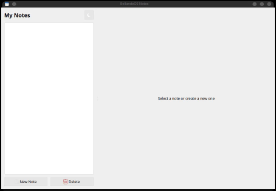
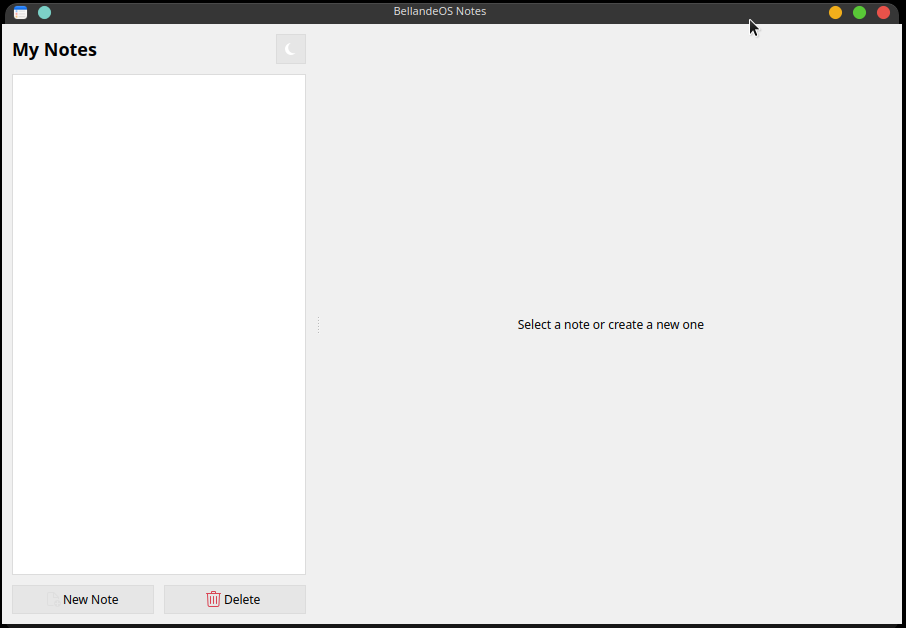

# BellandeOS Notes

## License

BellandeOS Packages is distributed under the [GNU General Public License v3.0](https://www.gnu.org/licenses/gpl-3.0.en.html), see [LICENSE](https://github.com/Algorithm-Model-Research/bellande_operating_system_package/blob/main/LICENSE) and [NOTICE](https://github.com/Algorithm-Model-Research/bellande_operating_system_package/blob/main/LICENSE) for more information.
